# CREATE TABLE
Antes de crear la tabla:

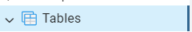
---
Después de crear la tabla:

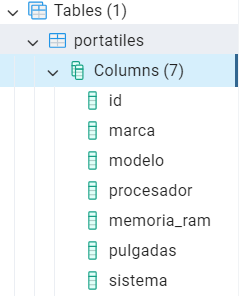
---
# CREATE
Antes de crear un portatil:

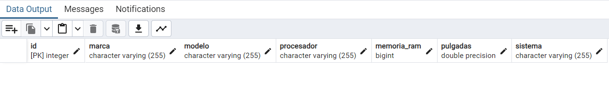
---
Creando un portatil:

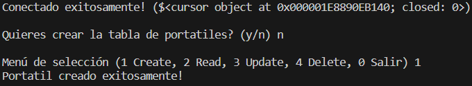
---
Después de crear un portatil:

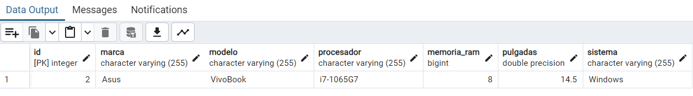
---
# READ
Leyendo la tabla vacía:

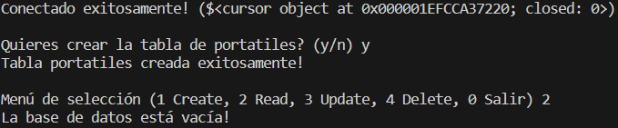
---
Leyendo la tabla con datos:

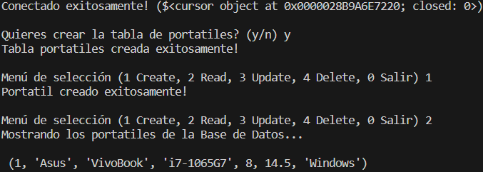
---
# UPDATE
Antes de actualizar un dato:

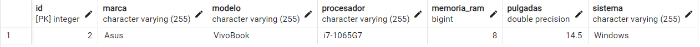
---
Actualizando un dato:

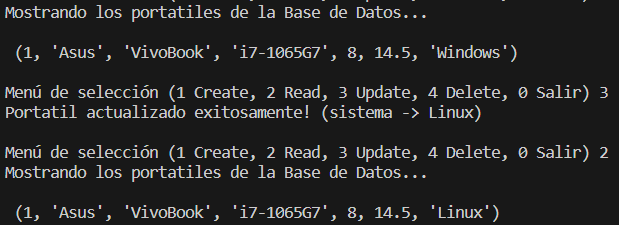
---
Después de actualizar un dato:

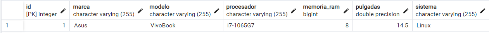
---
# DELETE
Antes de eliminar un dato:

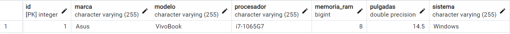
---
Eliminando un dato:

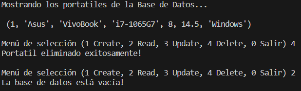
---
Después de eliminar un dato:

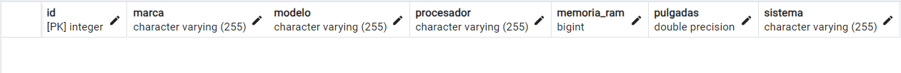
---